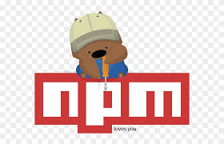

# Hola! 👋 Welcome to my Profile!

My highest aspiration is to become a professional in the Tech Industry as a Software Developer. I continue to grow by being adaptive and malleable to new concepts and paradigms. My willingness to work in a team is paramount to my conceptual knowledge and growth. I want to be an effective and approachable developer that is always willing to teach those around me.

🌱 I’m currently learning PERN Fullstack JavaScript Development at Code Fellows Tech Academy

      <-- Connect with me :D !

## Languages and Tools

  
  
  
  
  
  
  

  
  
  
    
  
  
  

